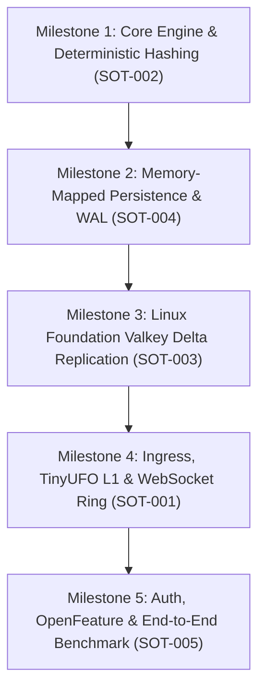

# INTENTION.md: EdgeFlag Daemon Engineering Intention & Execution Strategy (Hardened)
**Methodology:** Intention Engineering (`/intention-engineering`)
**Standard:** Phase State Machine, Quality Exit Gates, Verification-First, Zero-Drift Engineering

---

## 1. Engineering Intention & Market Positioning

EdgeFlag is an ultra-low-latency feature flag and dynamic configuration engine designed to eliminate the **SaaS Cost Tax** (MAU-based vendor pricing) by offering a high-performance, self-hosted, bare-metal-optimized daemon.

### Reconciled Architectural Reality
* **Market Framing:** Modern in-process SDKs (LaunchDarkly, Unleash, OpenFeature/flagd) already evaluate in-process in microseconds. EdgeFlag's genuine value proposition is **predictable self-hosted cost, zero outbound dependencies on read paths, and sub-10 µs in-process L1 caching**.
* **Throughput Target:** Single-core sustained evaluation throughput is calibrated to **$12,500\,\text{RPS}$ over TLS 1.3** ($\sim 80\,\mu\text{s}$ compute budget on 1 vCPU), with static L1 cache hits reaching $\ge 120,000\,\text{RPS}$.
* **Replication Fix:** Inter-node communication carries complete **State Delta Replication (`ReplicationDelta`)**, ensuring remote nodes persist updates into their local LMDB (`heed`) stores and eliminate stale-state reads.
* **Realistic Concurrency:** Memory sizing is calibrated to **$15,000\text{–}25,000$ persistent WebSockets per 2 GB node**, preserving a $39\%$ OOM buffer.

---

## 2. Phase State Machine & Quality Exit Gates

```
┌────────────────┐     Gate 0     ┌────────────────┐     Gate 1     ┌────────────────┐
│   Phase 0:     │ ─────────────> │   Phase 1:     │ ─────────────> │   Phase 2:     │
│   Planning     │                │  Architecture  │                │  File Design   │
└────────────────┘                └────────────────┘                └────────────────┘
                                                                             │
                                                                             │ Gate 2
                                                                             ▼
┌────────────────┐     Gate 4     ┌────────────────┐     Gate 3     ┌────────────────┐
│   Phase 4:     │ <───────────── │   Phase 4:     │ <───────────── │   Phase 3:     │
│  Verification  │                │ Implementation │                │ Code Skeleton  │
└────────────────┘                └────────────────┘                └────────────────┘
```

### Phase 0: Planning (Domain Skeleton)
* **Goal:** Deconstruct system requirements into non-overlapping Bounded Contexts and Aggregates.
* **Exit Gate 0:** 
  - Every requirement (`REQ-001` .. `REQ-012`) maps to an aggregate in `SKELETON.md`.
  - Every aggregate protects an explicit, non-empty invariant.
  - State replication model is explicitly defined.

### Phase 1: Architecture (Folder Structure & SOLID DIP)
* **Goal:** Enforce SOLID Dependency Inversion (DIP) at the filesystem level.
* **Exit Gate 1:**
  - Folders structured strictly into `domain/`, `interfaces/`, `tests/`.
  - Each folder has an unambiguous single purpose ($\le 7$ words).
  - No cross-layer import cycles.

### Phase 2: File Design (Single Responsibility Principle)
* **Goal:** Enumerate every source file before code creation.
* **Exit Gate 2:**
  - Each file has a strict single responsibility statement ($\le 7$ words) and a "must never" clause.
  - Strict compliance with $\le 500$ lines per file.

### Phase 3: Code Skeleton (Signatures & Stubs)
* **Goal:** Define exact struct definitions, trait contracts, and function signatures.
* **Exit Gate 3:**
  - Complete project skeleton compiles cleanly with `cargo check` using `todo!()` stubs.
  - Zero compile errors, zero unresolved external types.

### Phase 4: Implementation & Verification (Node-by-Node)
* **Goal:** Implement method logic one unit at a time, strictly following the Execution Algorithm.
* **Exit Gate 4:**
  - Compiler evidence captured (clean build).
  - Real runtime fixture execution produces matching output artifacts.
  - Traceability chain intact from `REQ` to `VERIFY`.

---

## 3. Iteration Roadmap & Sprint Milestones



### Milestone 1: Core Rule Engine & SIMD Evaluation
* Implement `EvaluationContext`, vector rule matching, and `xxHash64` bucketing.
* **Verification Target:** Sub-microsecond evaluation benchmark verifying uniform distribution across $100,000$ iterations.

### Milestone 2: Memory-Mapped Zero-Copy Storage
* Implement `heed` LMDB environment and `fjall` LSM Write-Ahead Log.
* **Verification Target:** Direct memory pointer dereference test confirming zero heap allocations during rule lookup.

### Milestone 3: Linux Foundation Valkey State Delta Replication
* Implement `fred` async client connection, Pub/Sub channel listener, and full `ReplicationDelta` sync to local `heed`.
* **Verification Target:** Multi-instance invalidation test proving $< 5\,\text{ms}$ cross-node synchronization.

### Milestone 4: Edge Ingress, TinyUFO Cache & WebSocket Egress
* Implement Axum/Tokio HTTP and WebSocket broadcaster with `Arc<[u8]>` FlatBuffer framing.
* **Verification Target:** 20,000 connection concurrent broadcast test with single memory buffer allocation.

### Milestone 5: Auth, OpenFeature & Full System Benchmark
* Add admin Bearer token auth, OpenFeature output schema, and run full release benchmarks verifying $P_{99} \le 100\,\mu\text{s}$.
