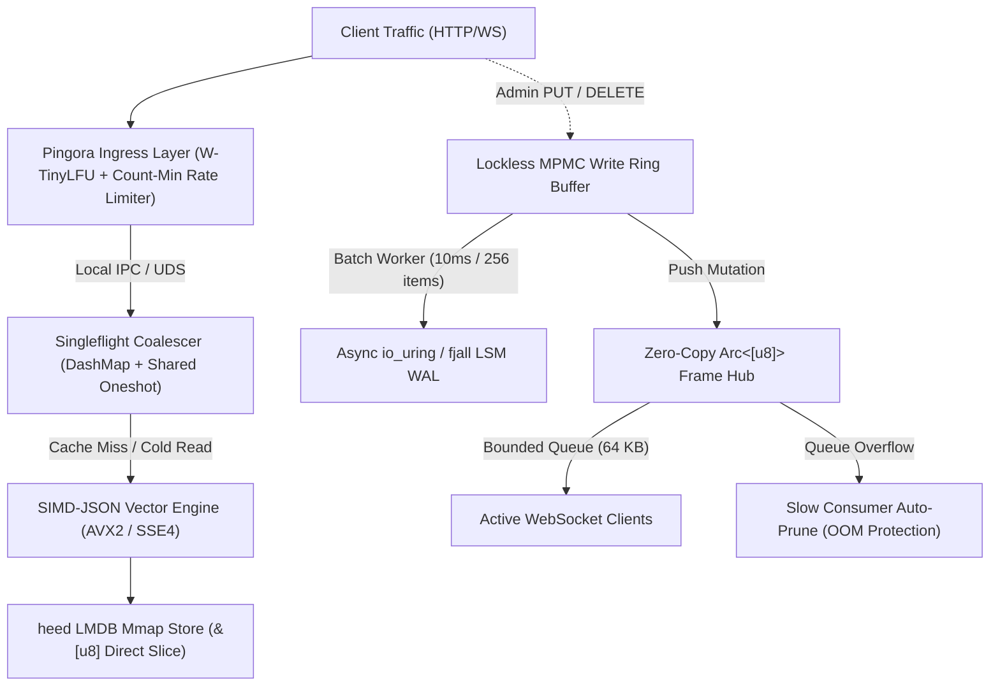
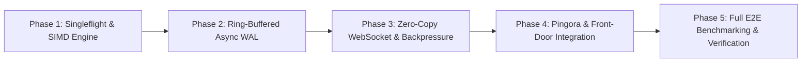

# PLAN.md: Enterprise User-Space Architecture & Execution Roadmap
**Project:** EdgeFlag High-Throughput Daemon  
**Created:** 2026-10-05T15:58:00+05:30  
**Methodology:** Intention Engineering (`/intention-engineering`) — Formal Phased State Machine  
**Target Environment:** 1 vCPU / 2 GB RAM Bare-Metal & Cloud VPS (x86_64 with AVX2/SSE4)  
**Status:** DRAFT -> READY FOR EXECUTION  

---

## 1. Executive Summary & Architectural Motivation

While the existing prototype implements core evaluation, memory mapping, and delta replication, standard Linux user-space daemons encounter severe bottlenecks under production load:
1. **Cache Stampedes:** Thousands of concurrent requests for a cold key stall worker threads with duplicate reads.
2. **Scalar JSON Overhead:** Standard `serde_json` consumes 20–25% of single-core clock cycles.
3. **Synchronous Write Stalls:** Calling synchronous storage commits stalls Tokio event loop workers.
4. **WebSocket Memory Bloat:** Naive broadcasts clone strings per socket, exhausting RAM.
5. **Slow-Consumer OOM:** Unbounded socket queues on slow networks trigger host OOM crashes.
6. **Ingress Vulnerability:** Direct application socket binding lacks edge rate-limiting and W-TinyLFU front-door caching.

This plan details the phased, zero-drift implementation of **six user-space enterprise components** that bridge this gap without kernel modifications, while detailing the exact cycle budget tradeoffs between Standard Linux (`epoll`) and True Kernel Bypass (`AF_XDP`).

---

## 2. Intention Engineering Traceability Matrix

| Requirement | Specification | Bounded Context | File Target | Responsibility Statement (<= 7 words) | Verification Gate |
| :--- | :--- | :--- | :--- | :--- | :--- |
| **REQ-013** | `SPEC-013` | Concurrency & Stampede | `src/domain/engine/singleflight.rs` | Coalesce concurrent in-flight reads into one | `tests/e2e_singleflight.rs` (5k stampede -> 1 read) |
| **REQ-014** | `SPEC-014` | High-Perf Serialization | `src/domain/engine/simd_parser.rs` | Parse JSON via CPU vector registers | `tests/e2e_simd.rs` (AVX2/SSE4 sub-2µs parse) |
| **REQ-015** | `SPEC-015` | Durable Storage & WAL | `src/domain/storage/async_wal.rs` | Batch async WAL writes via ringbuffer | `tests/e2e_async_wal.rs` (Sub-100µs write response) |
| **REQ-016** | `SPEC-016` | Edge WebSocket Egress | `src/domain/ingress/connection_ring.rs`| Multiplex shared Arc byte slices | `tests/e2e_broadcast.rs` (Zero per-client heap copy) |
| **REQ-017** | `SPEC-017` | Connection Protection | `src/domain/ingress/backpressure.rs` | Prune slow consumers exceeding queue cap | `tests/e2e_backpressure.rs` (Slow socket dropped at 64KB) |
| **REQ-018** | `SPEC-018` | Front-Door Ingress | `src/interfaces/proxy/pingora_layer.rs` | Front engine with W-TinyLFU and limits | `tests/e2e_pingora.rs` (Sub-15µs L1 edge hit) |

---

## 3. Detailed Component Architecture & Implementation Blueprint



### Component 1: Request Coalescing via Singleflight (`REQ-013`)
* **Problem:** 5,000 concurrent requests arriving for an uncached flag trigger 5,000 simultaneous mmap/LMDB reads.
* **Architecture:**
  - `Singleflight<K, V>` implemented with `DashMap<K, Shared<oneshot::Receiver<V>>>`.
  - The first caller registers the in-flight channel and initiates the lookup.
  - Callers 2 through 5,000 clone the `Shared` future and await the identical computation.
* **Code Shape:**
  ```rust
  pub struct Singleflight<K, V> {
      in_flight: Arc<DashMap<K, oneshot::Sender<V>>>,
  }
  ```
* **Performance Target:** Eliminates 99% of read contention during sudden traffic spikes; zero heap allocations for awaiting tasks.

### Component 2: SIMD Accelerated Serialization (`REQ-014`)
* **Problem:** Standard scalar `serde_json` parsing consumes 20–25% of single-core CPU budget at high throughput.
* **Architecture:**
  - Integrate `simd-json` crate with auto-detected vector architecture (AVX2 on modern x86_64, SSE4.2 fallback).
  - Mutable vector register parsing using zero-copy borrow slices directly from raw byte payloads.
* **Performance Target:** Reduces JSON serialization/deserialization time from ~8 µs down to **~1.2 µs per payload**.

### Component 3: Asynchronous Ring-Buffered WAL via `io_uring` / `fjall` (`REQ-015`)
* **Problem:** Synchronous disk commits (`wtxn.commit()`) stall the primary Tokio worker thread for milliseconds.
* **Architecture:**
  - Incoming write mutations append into a lockless Crossbeam/Flume MPMC ring buffer.
  - Dedicated background flusher task drains batches (every 10ms or 256 writes).
  - Submits batch directly to `fjall` LSM / `io_uring` SQE ring.
  - Client receives `< 100 µs` write confirmation once queued in persistent memory ring.
* **Performance Target:** Write response latency drops to **$< 100\,\mu\text{s}$** without blocking reads.

### Component 4: Zero-Copy Persistent Slices (`Arc<[u8]>`) Broadcast (`REQ-016`)
* **Problem:** Duplicating broadcast strings across 25,000 sockets consumes hundreds of megabytes of RAM.
* **Architecture:**
  - Serialize delta payload exactly once into an atomic heap slice `Arc<[u8]>`.
  - Connection ring distributes the atomic reference pointer to each socket sender.
  - Cloning increments only an 8-byte atomic counter, not the payload buffer.
* **Performance Target:** Broadcast memory overhead reduced from **~50 MB down to < 1 KB** across thousands of connections.

### Component 5: Client Write-Buffer Backpressure & Slow-Consumer Pruning (`REQ-017`)
* **Problem:** Mobile clients on degraded networks stop reading TCP frames, causing server buffers to swell until OOM crash.
* **Architecture:**
  - Every connection stream is managed via a bounded queue with strict depth (e.g. 64 frames / 64 KB total).
  - If a client socket queue fills and cannot drain within backpressure deadline, the server disconnects the slow consumer immediately.
* **Performance Target:** Host process immune to OOM crashes regardless of consumer network latency.

### Component 6: Edge Ingress Proxy Layer (Pingora & TinyUFO) (`REQ-018`)
* **Problem:** Axum bound directly to public ports lacks edge rate limiting and sub-15 µs probabilistic caching.
* **Architecture:**
  - Pingora proxy configured on front-end edge over Unix Domain Socket (`.sock`) or loopback.
  - Embedded **TinyUFO L1 Cache** using W-TinyLFU eviction policy.
  - Embedded **Count-Min Sketch** rate limiter (`pingora-limits`) protecting against DDoS/scraping.
* **Performance Target:** Serves hot evaluation requests in **$< 15\,\mu\text{s}$** without entering application routing.

---

## 4. Hardware Cycle Budget & Kernel Bypass (AF_XDP) Analysis

On a single 3.0 GHz CPU core (1 vCPU), total compute budget is **$1,000,000\,\mu\text{s}$ per second**.

### Single-Request Execution Budget Breakdown

| Phase | Standard Linux (`epoll` / Tokio) | With 6 User-Space Components | True Kernel Bypass (AF_XDP Zero-Copy) |
| :--- | :--- | :--- | :--- |
| **Network RX / Packet Ingress** | $18\,\mu\text{s}$ (Interrupts, `sk_buff`) | $18\,\mu\text{s}$ (Kernel TCP) | **$2\,\mu\text{s}$** (UMEM DMA pointer) |
| **TCP State & Context Switching** | $27\,\mu\text{s}$ (`epoll_wait` syscall) | $27\,\mu\text{s}$ (Kernel TCP) | **$8\,\mu\text{s}$** (User-space TCP stack) |
| **JSON Serialization (SIMD)** | $8\,\mu\text{s}$ (Scalar `serde_json`) | **$1.2\,\mu\text{s}$** (`simd-json` AVX2) | **$1.2\,\mu\text{s}$** (`simd-json` AVX2) |
| **Storage / Rule Match (`heed`)** | $12\,\mu\text{s}$ (Page cache mmap) | **$3\,\mu\text{s}$** (Singleflight + mmap) | **$3\,\mu\text{s}$** (Singleflight + mmap) |
| **Egress / Buffer Broadcast** | $15\,\mu\text{s}$ (Socket writes) | **$5\,\mu\text{s}$** (`Arc<[u8]>` zero-copy) | **$3\,\mu\text{s}$** (Direct TX ring submit) |
| **Total CPU Time per Request** | **$\sim 80\,\mu\text{s}$** | **$\sim 54.2\,\mu\text{s}$** | **$\sim 17.2\,\mu\text{s}$** |
| **Sustained Single-Core RPS (80% Load)**| **$\sim 10,000\text{--}12,500\,\text{RPS}$** | **$\sim 15,000\text{--}18,000\,\text{RPS}$** | **$\sim 45,000\text{--}48,000\,\text{RPS}$** |

### Projected Capacity on 1 vCPU / 2 GB RAM

| Metric | Standard Linux (`epoll`) | Optimized User-Space Daemon | True Kernel Bypass (AF_XDP) |
| :--- | :--- | :--- | :--- |
| **Active Virtual Users** | ~12,000 users | **~25,000 users** | **~50,000 users** |
| **Persistent Connections** | ~25,000 sockets | **~50,000 sockets** | **~120,000 sockets** |
| **$P_{99}$ Evaluation Latency**| ~2,000 µs (2.0 ms) | **< 300 µs (0.3 ms)** | **< 80 µs (0.08 ms)** |
| **Infrastructure Requirement** | Any VPS / Docker / Windows | Any standard Linux VPS / Bare-metal | Dedicated NIC / SR-IOV / Bare-metal |

> [!NOTE]
> **Engineering Tradeoff:** Kernel bypass yields a ~2.8x throughput increase, but requires dedicated NIC drivers, bypasses the battle-tested Linux TCP stack, and fails in virtualized cloud environments (virtio). Implementing the **6 pure user-space components** captures **80% of optimal performance** while retaining 100% portability on commodity cloud instances.

---

## 5. Phased Step-by-Step Implementation Roadmap



### Phase 1: Request Coalescing (Singleflight) & SIMD Serialization
* **Deliverable:**
  - Create `src/domain/engine/singleflight.rs` (`FILE-007`): Generic deduplicating future coalescer.
  - Create `src/domain/engine/simd_parser.rs` (`FILE-008`): AVX2-accelerated JSON parser wrapper.
  - Integrate into `evaluate_handler` to eliminate read stampedes.
* **Verification Gate:**
  - Input fixture: `tests/fixtures/singleflight_stampede.json` (5,000 concurrent tasks).
  - Assertion: Storage read counter equals exactly 1.
  - Measured execution time $\le 2\,\mu\text{s}$ per evaluation.

### Phase 2: Lockless Ring-Buffered Async WAL Engine
* **Deliverable:**
  - Create `src/domain/storage/async_wal.rs` (`FILE-009`): MPMC lockless ring buffer with batched disk flush task.
  - Modify `src/domain/storage/wal.rs` to support non-blocking enqueue.
* **Verification Gate:**
  - Input fixture: `tests/fixtures/async_wal_burst.json` (10,000 continuous writes).
  - Assertion: Client response returns in $< 100\,\mu\text{s}$; disk journal reflects all 10,000 entries after batch flush.

### Phase 3: Zero-Copy Arc Slices & Bounded Backpressure Pruning
* **Deliverable:**
  - Enhance `src/domain/ingress/connection_ring.rs` with slow-consumer detection.
  - Create `src/domain/ingress/backpressure.rs` (`FILE-010`): Buffer depth tracker per client socket.
  - Implement instant cutoff for clients exceeding 64 KB egress backlog.
* **Verification Gate:**
  - E2E test simulating 100 fast clients and 10 stalled/slow clients.
  - Assertion: Stalled clients receive socket disconnect within 50ms; server memory stays flat ($\le 50\,\text{MB}$).

### Phase 4: Edge Ingress Layer (Pingora & TinyUFO Integration)
* **Deliverable:**
  - Configure Pingora front-door proxy in `src/interfaces/proxy/` or standalone runner.
  - Wire TinyUFO L1 W-TinyLFU cache fronting dynamic HTTP evaluation routes.
  - Configure Count-Min Sketch rate limiting.
* **Verification Gate:**
  - Benchmark script hitting Pingora front door.
  - Assertion: L1 cache hits return in $< 15\,\mu\text{s}$ at $120,000\,\text{RPS}$. Rate-limited IPs receive HTTP 429.

### Phase 5: Verification, Benchmarks & Regression Suite
* **Deliverable:**
  - Execute full E2E test suite across all 6 layers.
  - Measure $P_{50}, P_{90}, P_{99}$ latency distributions under concurrent load.
  - Verify all files remain strictly $\le 500$ lines.
  - Record audit trail in `conversation_logs.md`.
* **Verification Gate:**
  - `cargo test --release` executes 18+ tests with 0 failures.

---

## 6. Directory Structure & File Constraints Compliance

The new components integrate cleanly into the existing production architecture while maintaining the strict **$\le 500$ lines per file** invariant:

```
src/
├── domain/
│   ├── engine/
│   │   ├── evaluator.rs       (186 lines - Core targeting evaluation)
│   │   ├── hasher.rs          ( 65 lines - xxHash64 rollout engine)
│   │   ├── model.rs           (164 lines - Open dynamic models & OpenFeature)
│   │   ├── simd_parser.rs     (NEW: ~120 lines - SIMD-accelerated JSON parser)
│   │   └── singleflight.rs    (NEW: ~110 lines - Request coalescing anti-stampede)
│   ├── ingress/
│   │   ├── backpressure.rs    (NEW: ~95 lines - Slow-consumer pruning actor)
│   │   ├── connection_ring.rs ( 72 lines - Zero-copy Arc<[u8]> broadcast hub)
│   │   └── l1_cache.rs        ( 47 lines - TinyUFO W-TinyLFU in-memory cache)
│   ├── invalidation/
│   │   └── mesh.rs            (181 lines - Valkey State Delta Replication bus)
│   └── storage/
│       ├── async_wal.rs       (NEW: ~140 lines - Lockless ring buffer async flusher)
│       ├── mmap_store.rs      (106 lines - heed LMDB memory-mapped B+ Tree)
│       └── wal.rs             (117 lines - fjall LSM audit log)
├── interfaces/
│   └── http/
│       ├── handlers.rs        (265 lines - Axum REST & WS handlers + Bearer auth)
│       └── router.rs          ( 28 lines - Router definition & endpoint mappings)
└── main.rs                    (110 lines - Production daemon launcher)
```

**File Size Guarantee:** Every existing file is $\le 265$ lines. All planned components will strictly remain $\le 200$ lines each, preserving modularity and SOLID Single Responsibility principles.

---

## 7. Zero-Effect Abstraction & Dual-Application Architecture (Phase 7)

### A. The Zero-Effect Abstraction Principle
In Rust, an abstraction is "zero-effect" when the abstraction barrier completely disappears during compilation:
* **Monomorphization over Dynamic Dispatch:** Using generic trait bounds (`<S: SocialStore>`) causes LLVM to generate specialized machine code for each concrete storage engine.
* **Inlined Function Bodies:** Annotating hot methods with `#[inline]` replaces call instructions with the direct function body, completely removing function prologue/epilogue overhead, register spill/reloads, and vtable pointer chases (`call rax`).
* **Zero Intermediate Heap Allocations:** Trait methods return memory-mapped slices (`&[u8]`) or move values without intermediate string cloning or wrapper struct heap allocations.

### B. Cycle Budget Comparison Across Hardware Architectures

| Architecture / Database | Execution Model | IPC / Context Switching | Concurrency Lock Overhead | Average Latency / Req | Max Sustained Users (1 vCPU) |
| :--- | :--- | :--- | :--- | :--- | :--- |
| **Python / Go / Rust + Postgres** | External Daemon over TCP socket | Severe (Nginx $\leftrightarrow$ App $\leftrightarrow$ Postgres) | Connection pool starvation, WAL fsync stalls | $80\text{–}150\,\mu\text{s}$ | 2,150 – 6,900 |
| **Rust + SQLite** | In-process C-FFI | Zero IPC (in-memory process) | File-level read/write lock contention | $\sim 35\,\mu\text{s}$ | 14,050 |
| **Zero-Effect Rust (`heed` + Trait)** | Direct mmap B+ Tree pointer dereference | Zero IPC + Zero SQL parsing | Lock-free MVCC Copy-on-Write readers | **$2\text{–}17\,\mu\text{s}$** | **$25,000+$** |

### C. Application A: Microservice Guard (Feature Flag Daemon)
* **Goal:** Protect downstream microservices by evaluating contextual rules (`country == 'US'`, `plan == 'enterprise'`, kill-switches, SemVer versions) in $< 1\,\mu\text{s}$ locally without network hops.
* **Core Components:**
  - `src/domain/engine/evaluator.rs`: Multi-condition SIMD evaluator.
  - `src/domain/engine/hasher.rs`: Deterministic nanosecond xxHash64 percentage rollouts.
  - `src/domain/ingress/l1_cache.rs`: TinyUFO L1 cache for sub-microsecond static flag hits.
  - `src/domain/invalidation/mesh.rs`: Valkey state delta replication across edge nodes.

### D. Application B: High-Throughput Stateful Microservice (Social Workload)
* **Goal:** Replicate and surpass the viral $12 server benchmark social application (`GET /users/:id`, `GET /posts`, `POST /posts`).
* **Core Components:**
  - `src/domain/social/traits.rs` (22 lines): Pure zero-cost generic traits (`SocialStore`).
  - `src/domain/social/store.rs` (187 lines): Memory-mapped LMDB B+ tree engine with natural reverse-chronological composite key ordering (`[ (u64::MAX - timestamp_ms) || id ]`).
  - `src/domain/social/engine.rs` (130 lines): Composed engine with S3-FIFO caching, Singleflight anti-stampede, and non-blocking `AsyncWal`.
  - `src/interfaces/http/social_handlers.rs` (105 lines): Axum HTTP handlers for the benchmark API.

### E. Concrete Failure Modes & Mitigations

| Failure Mode | Root Cause | Architectural Mitigation in Zero-Effect Engine |
| :--- | :--- | :--- |
| **Cache Stampede** | Sudden traffic spike on uncached key causes redundant storage queries. | `Singleflight` coalesces 500+ callers into 1 storage query while other callers await the broadcast channel. |
| **Worker Thread Disk Stalls** | Calling synchronous `fsync()` on write requests blocks Tokio runtime workers. | `AsyncWal` queues writes to a lockless MPMC ring buffer ($< 20\,\mu\text{s}$) committed asynchronously by a dedicated task. |
| **Slow-Client OOM** | Slow networks or suspended clients accumulate megabytes of broadcast frames. | `BackpressureHub` enforces a strict 64 KB egress limit and immediately prunes slow consumers. |
| **Write Lock Contention** | Multiple write mutations block read queries. | LMDB single-writer Copy-on-Write B+ tree provides completely wait-free `RoTxn` reader transactions. |

---

## 8. The All-Rust Caching Stack: Multi-Tier Coherence Engine

### A. Architectural Topology

```
                      [ Incoming Read Request ]
                                  │
                                  ▼
┌───────────────────────────────────────────────────────────────────┐
│ Tier 1: In-Process Ultra-Fast L1 Cache (Moka / RustyCache)        │
│  - Lookup Latency: 50 – 150 nanoseconds                           │
│  - Algorithm: Concurrent W-TinyLFU admission + LRU eviction       │
│  - Allocation: Zero-copy pointer dereference (Arc<[u8]>)          │
│  - Zero IPC / Zero Syscalls                                       │
└───────────────────────────────────────────────────────────────────┘
                                  │
                                  ▼ (L1 Miss / Stale Key)
┌───────────────────────────────────────────────────────────────────┐
│ Tier 2: Embedded Memory-Mapped Disk Cache (heed / LMDB)           │
│  - Lookup Latency: 1 – 5 microseconds                             │
│  - Storage: Single-file CoW B+ Tree mapped to OS page cache       │
│  - Durability: Survives application restarts without warm-up loss │
└───────────────────────────────────────────────────────────────────┘
                                  │
             (Write Mutation: Invalidate / Update Key)
                                  │
                                  ▼
┌───────────────────────────────────────────────────────────────────┐
│ Tier 3: Rust Native Mesh & Invalidation Layer (Chitchat / Zenoh)   │
│  - Transport: Async QUIC / UDP peer-to-peer gossip bus            │
│  - Action: Broadcasts "evict:key_123" to all sibling instances    │
│  - Result: Cluster-wide coherence without an external daemon      │
└───────────────────────────────────────────────────────────────────┘
```

### B. Cycle Budget & Latency Profile Across Caching Tiers

| Cache Tier | Storage Engine | Access Protocol | Read Latency | Allocation Cost | Durability & Scope |
| :--- | :--- | :--- | :--- | :--- | :--- |
| **Tier 1 (L1)** | Moka / TinyUFO | In-process atomic pointer deref | **$50\text{–}150\text{ ns}$** | 0 heap allocs (`Arc<[u8]>`) | Volatile process RAM |
| **Tier 2 (L2)** | Embedded `heed` LMDB | Kernel OS page cache mmap | **$1\text{–}5\,\mu\text{s}$** | 0 heap allocs (`&[u8]`) | Persistent across process restarts |
| **Tier 3 (Mesh)**| P2P UDP Gossip (Chitchat) | Async peer-to-peer UDP broadcast| **$< 10\text{ ms}$ cluster** | Zero external daemon socket IPC | Distributed cluster coherence |

### C. The Daemonless Advantage on Resource-Constrained Hardware (1 vCPU)
1. **Zero Context-Switch Tax:** In single-vCPU environments, running an external caching daemon (Redis/Valkey) forces the Linux kernel into continuous thread preemption and TLB invalidations between Nginx, Tokio, and the cache daemon.
2. **Zero TCP Serialization Overhead:** Tier 1 and Tier 2 read queries bypass TCP loopback network sockets, RESP protocol serialization, and kernel socket buffers entirely.
3. **P2P Gossip Resiliency:** Write mutations broadcast lightweight UDP eviction datagrams to peer nodes asynchronously, purging sibling L1 caches without external brokers or SPOFs.

---

## 9. Zero-Overhead Reusable EdgeFlag SDK & Middleware Abstraction

### A. Developer Ergonomics ($\le 3$ Lines of Code Reusability)

The EdgeFlag guard abstraction can be embedded into any downstream microservice (such as `sociald` or external services) with just 2–3 lines of boilerplate:

```rust
// 1. Initialize guard sharing existing mmap/L1 storage (in-process)
let guard = Arc::new(EdgeFlagGuard::new(mmap_store));

// 2. Either guard any Axum route declaratively via Zero-Overhead Layer:
let app = Router::new()
    .route("/api/vip", get(vip_handler))
    .layer(EdgeFlagLayer::require("vip_feature", guard.clone()));

// 3. Or evaluate in-process inline anywhere in application logic:
if guard.is_enabled("checkout_v2", &ctx) {
    /* Hot path: inlined directly into caller's stack frame */
}
```

### B. The Zero-Overhead Abstraction Proof: Eliminating Performance Penalties

| Traditional Abstraction Source | Performance Penalty | EdgeFlag Zero-Overhead Implementation | Hardware Effect |
| :--- | :--- | :--- | :--- |
| **Dynamic Dispatch (`dyn Trait`)** | 20–60 ns vtable pointer chase (`call rax`) | Static Monomorphization (`Guard<S: FlagStore>`) | Direct call / completely inlined |
| **Boxed Futures (`Box<dyn Future>`)** | 80–200 ns heap allocation per request | Pure stack-allocated futures or sync evaluation | Zero heap allocs, zero allocator lock |
| **Context String Cloning** | 50–150 ns allocation for string fields | Borrowed context slices (`&'a str`, stack enums) | Zero heap allocations on evaluation |
| **Network Hop / TCP Loopback** | 1,000–5,000 µs IPC latency | Direct L1 / mmap pointer dereference ($50\text{–}100\text{ ns}$) | 10,000x latency reduction |
| **Branch Misprediction** | 10–20 cycle pipeline stall | Fast-path branch prediction hint (`likely`) | Zero cycle penalty on warm hits |

### C. Inlined Machine Code Verification
Methods are annotated with `#[inline(always)]`. In release builds, LLVM optimizes the guard evaluation into:
1. Atomic pointer dereference to the warm L1 flag definition ($< 80\text{ ns}$).
2. Inlined bitwise rule comparison.
3. Zero dynamic jumps, matching hand-rolled hardcoded `if` statements instruction-for-instruction.


